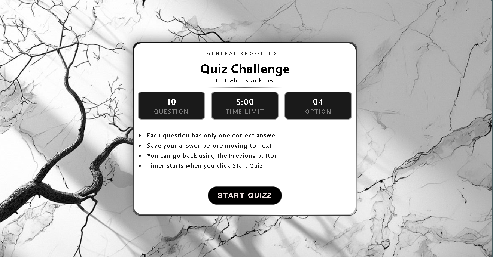
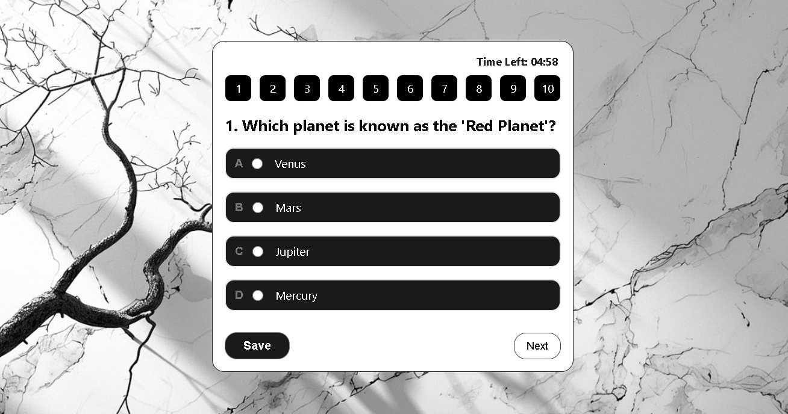
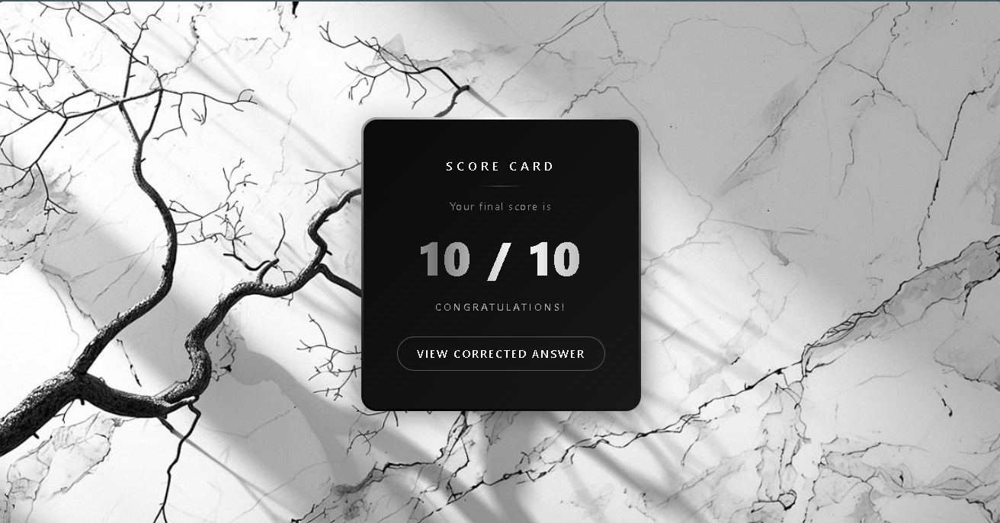
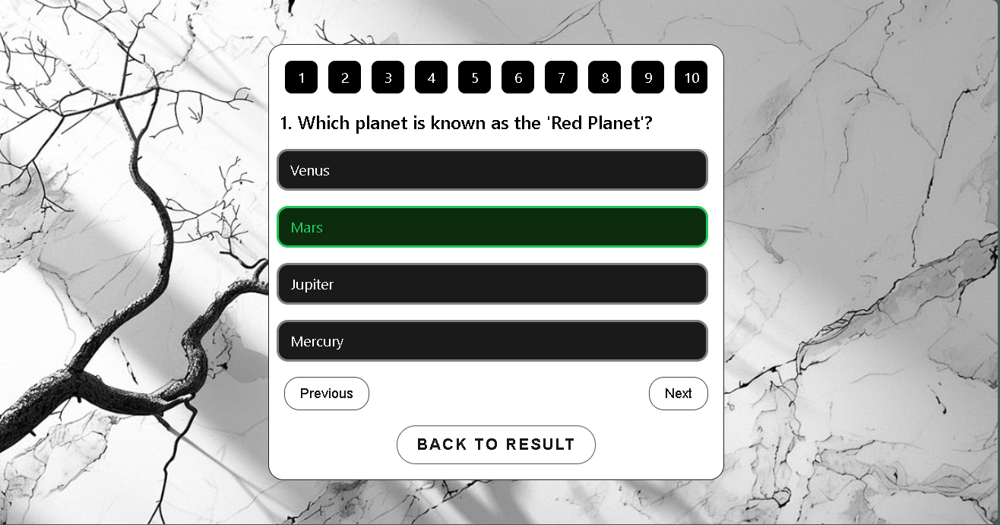

# 🧠 Quiz Challenge

A modern and interactive quiz application built with **Vanilla HTML, CSS & JavaScript** featuring a countdown timer, answer navigation, instant score calculation, and detailed answer review.


---

# 📸 Preview

## 🚀 Start Screen



---

## ❓ Quiz Screen



---

## 🏆 Result Screen



---

## ✅ Review Screen



---

## ✨ Features

- 🎯 Interactive multiple-choice quiz
- ⏳ Countdown timer (5 Minutes)
- 💾 Save answers before moving forward
- ⬅️ Previous / Next navigation
- 🔢 Jump directly to any question
- ❌ Clear selected answer
- 🏁 Automatic quiz submission when time expires
- 📊 Instant score calculation
- ✅ Review every question after completion
- 🟢 Correct answers highlighted
- 🔴 Incorrect selected answers highlighted
- 📱 Responsive user interface
- 🎨 Modern black & white animated design

---

## 🛠️ Tech Stack

| Technology | Usage |
|------------|-------|
| HTML5 | Structure |
| CSS3 | Styling, Responsive Design, Animations |
| JavaScript (ES6) | Quiz Logic, DOM Manipulation, Timer |

---

## 🚀 Getting Started

### 1. Clone the repository

```bash
git clone https://github.com/XR-9/quiz-challenge-app.git
cd quiz-challenge-app
```

### 2. Open the project

Simply open

```text
index.html
```

inside your browser.

No installation required.

---

## 📁 Project Structure

```
javascript-quiz-app/
│
├── index.html
├── index.css
├── index.js
├── background.jpeg
├── preview/
│   ├── start.png
│   ├── quizz.png
│   ├── result.png
│   └── review.png
└── README.md
```

---

## ⚙️ Application Flow

```
Start Quiz
      │
      ▼
Answer Questions
      │
      ▼
Save Answers
      │
      ▼
Navigate Between Questions
      │
      ▼
Quiz Ends / Timer Expires
      │
      ▼
View Score
      │
      ▼
Review Correct & Wrong Answers
```

---

## 💡 What I Learned

- Dynamic DOM Manipulation
- Event Handling
- JavaScript Arrays & Objects
- Timer using `setInterval()`
- State Management
- Score Calculation Logic
- Dynamic Question Rendering
- Responsive UI Design
- Review System Implementation

---

## 📄 License

This project is open source under the **MIT License**.

---

<p align="center">
Fueled by curiosity and countless cups of coffee ☕ — <strong>XR</strong>
</p>